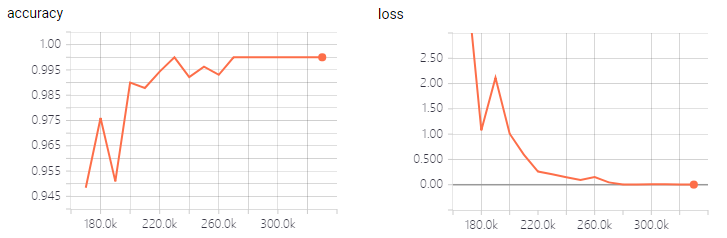

# sliding convolution
ocr recognization based on the method of sliding convolution,from this paper [Scene Text Recognition with Sliding Convolutional Character Models](https://arxiv.org/pdf/1709.01727.pdf)

## dependencies
tensorflow1.3,or 1.4
> 
python3

## datasets
（1）[VGG Synthetic Word Dataset](http://www.robots.ox.ac.uk/~vgg/data/text/) 
（2）[合成的中文数据]（https://pan.baidu.com/s/1dFda6R3 ） 

## make images and labels to tfrecords
    cd make_tfrecords/
    python3 data_to_tfrecord.py
## train
    python3 train_test.py --mode=train

## test
    python3 train_test.py --mode=test